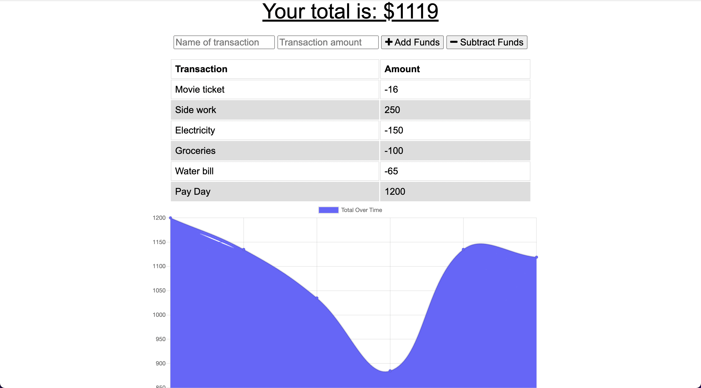
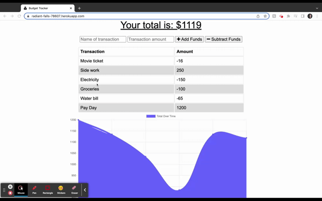

# Jack Atkerson Challenge 19: PWA Budget Tracker

## Description
An app that is used to track and log expenses and incomes, as well as display the transactions on a graph. This app is also able to be used while offline. 

## Table of Contents
- [Demonstration](#demonstration)
- [Usage](#usage)
- [Credits](#credits)
- [Questions](#questions)

## User Story

```
AS AN avid traveler
I WANT to be able to track my withdrawals and deposits with or without a data/internet connection
SO THAT my account balance is accurate when I am traveling 
```

## Demonstration
Homepage Screenshot:


A short demonstration of the app's functionality:


Heroku link:
https://radiant-falls-78607.herokuapp.com/

## Usage
This app is an easy to use budgeting tool. In the first textbox, enter the name for the transaction. Next, enter the amount earned or spent. Finally, click either the "+ Add Funds" or "- Subtract Funds" button to complete the transaction.

## Credits
Made by Jack Atkerson
Starter code from: https://github.com/coding-boot-camp/fantastic-umbrella

## Questions
Feel free to reach out to me at:
[E-Mail](mailto:jatkerson18@gmail.com),
[GitHub](https://github.com/JackAtkerson)